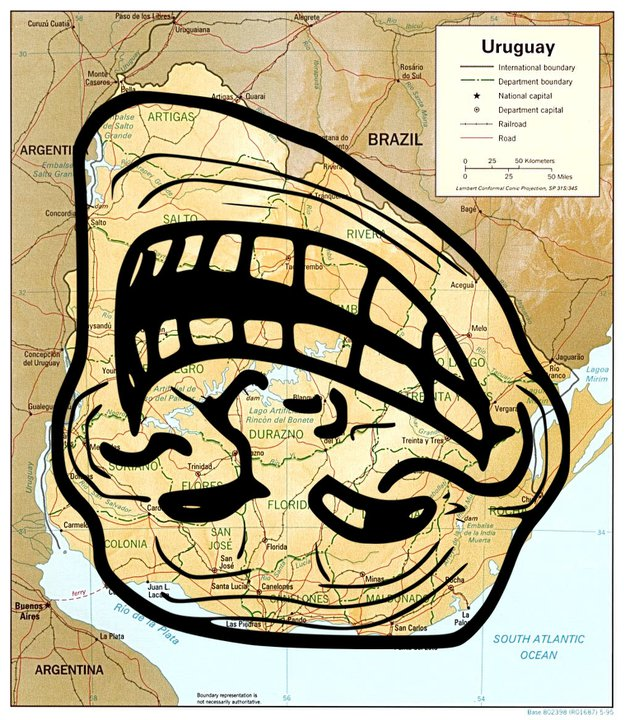
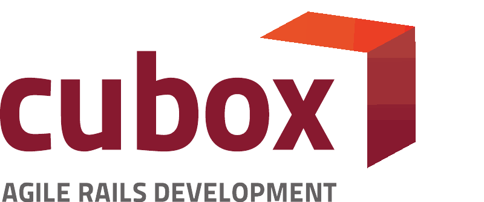

<!SLIDE center>

<!SLIDE center>
# Chris Kowalik

<!SLIDE center>
# @nu7hatch

<!SLIDE center>
# @nu7

<!SLIDE center>
# Polska!

<!SLIDE center>

<!SLIDE center main>
<h1>
  <small>Montevideo</small> 
  Uruguay
</h1>

<!SLIDE center>

<!SLIDE center>

<!SLIDE center main>
<h1>
  <small>JavaScript integration testing with</small> 
  V8 engine &amp; Ruby
</h1>

<!SLIDE center meme wee with-title>
# Headless browser!

<!SLIDE center>
# Why?

<!SLIDE bullets incremental>
* Lack of generic solution for headless integration testing
* Over 2000 selenium steps running for more than 3 hours
* Painful configuration across the machines and on CI server
* Wish to learn how V8 engine works

<!SLIDE center>
# Competitors

<!SLIDE center bullets incremental with-title>
# Browser drivers

* Selenium
* Watir
* Phantom

<!SLIDE center>
# Sloooooooow!

<!SLIDE center bullets incremental with-title>
# Pure JavaScript

* Jasmine
* ...

<!SLIDE center>
# Slooooooooooower!

<!SLIDE center bullets incremental with-title>
# Headless browsers

* HtmlUnit (Java)
* Zombie (Node.JS)
* EnvJS

<!SLIDE center>
# Painful for Rubyists :/

<!SLIDE center meme>

<!SLIDE center meme>

<!SLIDE center meme>

