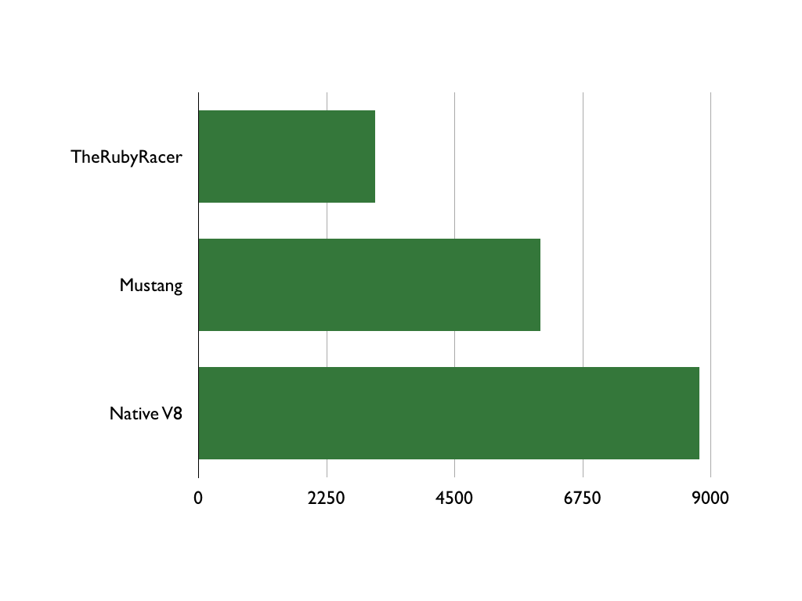

<!SLIDE center>
# Goals

<!SLIDE center bullets incremental>
* Speeeeeeeed!
* JavaScript support
* Speed...
* Friendly API
* Portability
* Did i mention speed?

<!SLIDE center meme>

<!SLIDE center>
# First plan...

<!SLIDE center>
Fast V8 extension for Ruby
+
Browser implementation

<!SLIDE center>
# Scaffold

<!SLIDE center bullets incremental>
* DOM parsing with Nokogiri
* HTTP client - RestClient / CURB
* JS processing with Mustang (V8)

<!SLIDE center>
<h1>Mustang - V8 in Ruby</h1>

  <h3><a href="http://github.com/nu7hatch/mustang">http://github.com/nu7hatch/mustang</a></h3>
  <h3><a href="http://github.com/cowboyd/therubyracer">http://github.com/cowboyd/therubyracer</a></h3>

<!SLIDE center meme>

<!SLIDE center meme>

