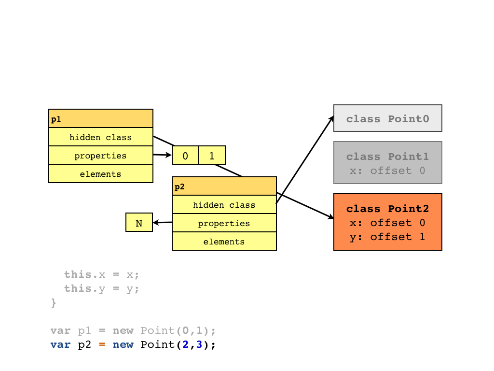
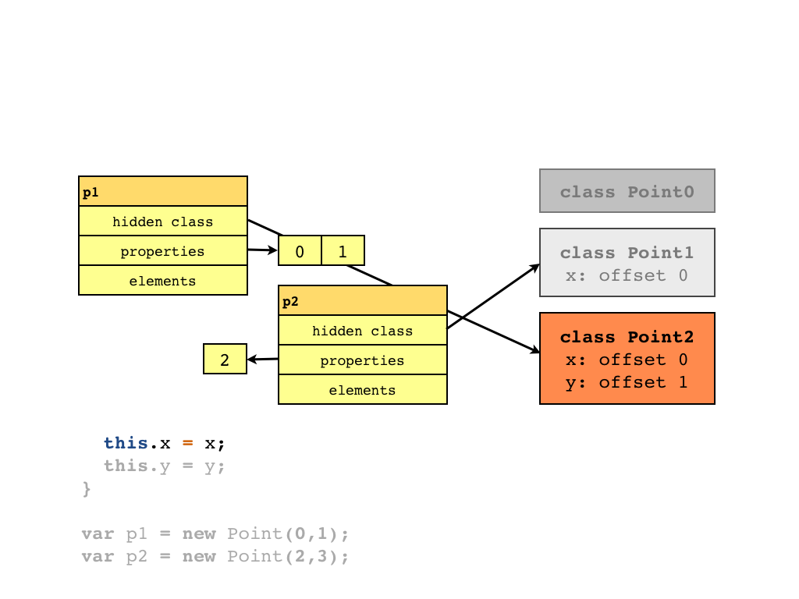

<!SLIDE center>
# Why V8 is awesome?

<!SLIDE center bullets incremental>
* Designed and built from scratch
* Focused on performance
* Open Source!
* Used by Chrome browser and Node.js

<!SLIDE center>
# Design goals

<!SLIDE center bullets incremental>
* Faster object-oriented apps
* Faster property access
* Faster function calls
* Faster memory management

<!SLIDE center>
# Design decisions

<!SLIDE center bullets incremental>
<ul>
  <li>Precise generational GC</li>
</ul>

<!SLIDE with-title>
# Garbage collection

    @@@cpp
    Handle<Value> hello_kaigi()
    {
      HandleScope scope;
      Handle<String> hello = String::New("Hello Kaigi!");
      Local<String> bar = String::New("bar");
      return scope.Close(hello);
    }

<!SLIDE center bullets>
<ul>
  <li class="blur">Precise generational GC</li>
  <li>Neat memory model</li>
</ul>

<!SLIDE center bullets incremental with-title>
# Memory model

* 32-bit tagged pointers
* Object pointers references <strong>hidden class</strong>, <strong>properties</strong>, and <strong>elements</strong>
* Instant access to small, 31-bit integers

<!SLIDE with-title center>
# Memory model

  <code>XXX..XXX<strong>0</strong></code> - integer 
  <code>XXX..XX<strong>01</strong></code> - object

<!SLIDE center bullets>
<ul>
  <li class="blur">Precise generational GC</li>
  <li class="blur">Neat memory model</li>
  <li>Hidden classes behind the scenes</li>
</ul>

<!SLIDE with-title>
# Hidden classes

    @@@javascript
    function Point(x,y)
    {
      this.x = x;
      this.y = y;
    }
    
    var p1 = new Point(0,1);
    var p2 = new Point(2,3);

<!SLIDE center with-title>

# Hidden classes

<!SLIDE center with-title>

# Hidden classes

<!SLIDE center with-title>

# Hidden classes

<!SLIDE center with-title>

# Hidden classes

<!SLIDE center with-title>

# Hidden classes

<!SLIDE center with-title>

# Hidden classes

<!SLIDE center with-title>

# Hidden classes

<!SLIDE center bullets>
<ul>
  <li class="blur">Precise generational GC</li>
  <li class="blur">Neat memory model</li>
  <li class="blur">Hidden classes behind the scenes</li>
  <li>Inline caching</li>
</ul>

<!SLIDE center bullets>
<ul>
  <li class="blur">Precise generational GC</li>
  <li class="blur">Neat memory model</li>
  <li class="blur">Hidden classes behind the scenes</li>
  <li class="blur">Inline caching</li>
  <li>Native code generation</li>
</ul>

<!SLIDE center meme>

