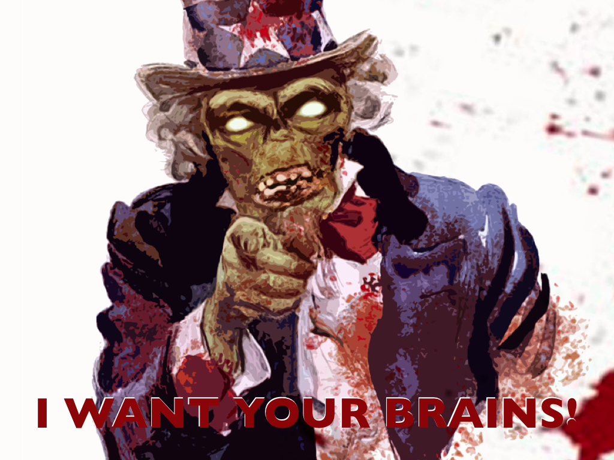

<!SLIDE center main>
<header style="font-size: 34px;">
  <a href="http://github.com/nu7hatch/mike">http://github.com/nu7hatch/mike</a>
</header>
<h1>
  Introducing Mike! 
  <small>The headless chicken</small>
</h1>
<footer>
  chicken...
</footer>

<!SLIDE center main>
<header style="font-size: 34px;">
  <a href="http://github.com/nu7hatch/mike">http://github.com/nu7hatch/mike</a>
</header>
<h1>
  Introducing Mike! 
  <small>The headless browser</small>
</h1>
<footer>
  chicken...
</footer>

<!SLIDE center>
headless browser with testing API in C++
 +
native extensions in Ruby, Python

<!SLIDE center>
# Inspirations

<!SLIDE center bullets incremental>
* HtmlUnit framework
* WebKit browser
* Node.JS and Zombie

<!SLIDE center>
# New scaffold

<!SLIDE center bullets incremental>
* DOM parsing with LibXML2
* HTTP client powered by LibCURL
* JS processing with LibV8

<!SLIDE center meme>

<h1 style="position: absolute; top: 20px; left: 65px; font-size: 65px; color: #001155;">
  KAMEHAMEHAAAA!
</h1>

<!SLIDE center>
# Things done

<!SLIDE center bullets>
<ul>
  <li>Multiple Windows</li>
</ul>

<!SLIDE center bullets>
<ul>
  <li class="blur">Multiple Windows</li>
  <li>Frames support</li>
</ul>

<!SLIDE center bullets>
<ul>
  <li class="blur">Multiple Windows</li>
  <li class="blur">Frames support</li>
  <li>Basic user interaction</li>
</ul>

<!SLIDE center bullets>
<ul>
  <li class="blur">Multiple Windows</li>
  <li class="blur">Frames support</li>
  <li class="blur">Basic user interaction</li>
  <li>Basic JavaScript execution</li>
</ul>

<!SLIDE center bullets>
<ul>
  <li class="blur">Multiple Windows</li>
  <li class="blur">Frames support</li>
  <li class="blur">Basic user interaction</li>
  <li class="blur">Basic JavaScript execution</li>
  <li>Alerts/popups mocking</li>
</ul>

<!SLIDE center bullets>
<ul>
  <li class="blur">Multiple Windows</li>
  <li class="blur">Frames support</li>
  <li class="blur">Basic user interaction</li>
  <li class="blur">Basic JavaScript execution</li>
  <li class="blur">Alerts/popups mocking</li>
  <li>Neat API :)</li>
</ul>

<!SLIDE center>
# Pending stuff

<!SLIDE center bullets incremental>
* Browser compliant JavaScript layer
* JavaScript events handling
* XmlHttpRequest
* WebSockets
* Ruby extension
* ...

<!SLIDE center meme>

